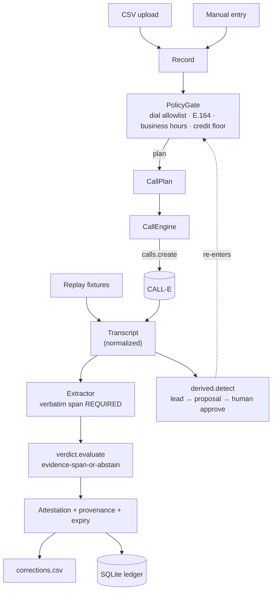

# Ghostline

**A phone-powered data-verification engine.** Give it a table of records and the claims
attached to them; it calls each number via **CALL-E**, asks, and returns
**MATCH / MISMATCH / UNCLEAR / NO&nbsp;CONTACT** for every claim — **with the exact words the
person used** as evidence — plus a `corrections.csv` a team can act on. It never returns a
verdict it can't quote.

> Ghostline doesn't claim truth. It creates a timestamped, evidence-backed record of what a
> specific human source said — and tells you when reality has moved on.

**Live:** https://ghostline-one.vercel.app · Built for the **CALL-E: Your Code Is Calling** hackathon.

The lifecycle: **asserted → verified → evidenced → corrected → expired → re-verified.**

---

## Why a phone call

The facts that rot fastest in an operational database — "is this office still here", "do they
still accept this plan", "is this still the contact", "are these hours current" — don't live in
any API. They live in a person's head and decay constantly. No scrape, no attestation portal,
no chatbot can retrieve them. Only a phone call can.

CMS's own national review found **48.74%** of Medicare Advantage provider-directory locations
had at least one inaccuracy. A Senate Finance secret-shopper study found an **18%**
appointment-booking success rate. Directory upkeep costs U.S. practices **$2.76B/year** (CAQH).
The fix has to talk to a human — so Ghostline does, and it's careful about what it believes.

## The one rule that makes it trustworthy

**Evidence-span-or-abstain.** A `MATCH` or `MISMATCH` verdict is *impossible* to produce
unless the extractor identifies a **verbatim quoted span from a recipient's turn** that
supports it. No span → forced `UNCLEAR`. This is a hard check in
[`ghostline/verdict.py`](ghostline/verdict.py) and in the skill's
[`_pcv.py`](skills/phone-claim-verifier/scripts/_pcv.py) — not a README promise:

```
Claim:      "currently accepts the Northline Health plan"     (asserted: true)
Recipient:  "We take most major commercial plans here."
CALL-E's own extractor:  accepts_plan = "yes"   (high confidence)
Ghostline:  UNCLEAR — no quote names the plan. Abstains rather than guess.
```

That contrast — Ghostline declining where a confident model would commit — is the whole point.

## Quick start

```bash
pip install -e ".[dev]"
cp .env.example .env          # add CALLE_API_KEY, and LLM_API_KEY for the real extractor

ghostline packs               # list claim packs
ghostline replay              # run the full pipeline over 9 recorded calls — 0 dialing
ghostline verify examples/providers-sample.csv --pack healthcare          # dry run: planned calls
ghostline verify examples/providers-sample.csv --pack healthcare --live   # places real CALL-E calls

uvicorn ghostline.console.app:app --port 8000       # the web console
```

`replay` and dry-run `verify` never touch CALL-E. Only `--live` spends a call.

### Web console

One screen. Type a record (or upload a CSV), pick a claim pack, choose **Replay** (explore 9
recorded calls, no dialing) or **Live** (Ghostline calls the number you typed). The result page
shows a chat-style transcript with the evidence span highlighted, the verdict with its
provenance and expiry, a plain-English batch summary, and — when a call surfaces a lead — a
**derived-call proposal** you approve with one click ("the answer wrote the next call").

## How CALL-E powers it — two surfaces, on purpose

| Surface | Where | Flow |
|---|---|---|
| **Python SDK** (`calle-ai`) | the hosted console + CLI engine | `PolicyGate.plan()` → `client.calls.create(task, recipients, result_schema, idempotency_key)` → poll `wait_for_result` (local) or `webhook_url` → `/calle/webhook` (serverless) → normalize `recipients[].attempts[].transcript_turns[]` |
| **MCP** (`plan_call` → `run_call` → `get_call_run`) | the [`skills/phone-claim-verifier/`](skills/phone-claim-verifier/) Agent Skill | runs inside agent environments where MCP is native; the confirm-token split is the "don't dial until approved" gate |

Ghostline runs its **own** extraction over the transcript (verbatim span required); CALL-E's
`structured_result` / `completion_confidence` are stored only as a *secondary* signal.
Full notes: [`Docs/research/CALL_E_INTEGRATION.md`](Docs/research/CALL_E_INTEGRATION.md).

## Architecture



Module map: [`models.py`](ghostline/models.py) · [`claim_pack.py`](ghostline/claim_pack.py) ·
[`policy_gate.py`](ghostline/policy_gate.py) · [`call_engine.py`](ghostline/call_engine.py) ·
[`calle_normalize.py`](ghostline/calle_normalize.py) · [`extractor.py`](ghostline/extractor.py) ·
[`verdict.py`](ghostline/verdict.py) · [`corrections.py`](ghostline/corrections.py) ·
[`derived.py`](ghostline/derived.py) · [`pack_generator.py`](ghostline/pack_generator.py) ·
[`benchmark.py`](ghostline/benchmark.py) · [`store.py`](ghostline/store.py) ·
[`replay.py`](ghostline/replay.py) · [`cli.py`](ghostline/cli.py) · [`console/`](ghostline/console/)

## Extending to a new domain

Write a claim pack — a YAML or JSON file. Bundled packs live in
[`ghostline/data/packs/`](ghostline/data/packs/) (healthcare, supplier-crm,
community-services); drop your own into a repo-root `packs/` or `examples/` dir. Or describe
the domain in a sentence on the `/packs` page and an LLM drafts one for you to approve. The
engine never changes.

```yaml
pack_id: suppliers
display_name: Supplier contact records
expires_after_days: 180
claims:
  - claim_id: still_supplies_us
    question: Do you still supply parts to Harbor Manufacturing under contract HM-2231?
    expected_type: boolean
    subject_terms: ["harbor manufacturing", "hm-2231", "the contract"]
    answer_guidance: >
      yes only on an explicit confirmation of HM-2231; no only on an explicit statement it
      ended. "We work with lots of suppliers" is unknown.
```

## Tests & reliability

```bash
pytest -q                        # 59 tests
ruff check ghostline tests scripts skills
python scripts/run_benchmark.py  # -> benchmark/results.json (fixture-derived; --source live for real calls)
```

Coverage includes: evidence-span enforcement (no span / non-verbatim span → UNCLEAR), the
**dial allowlist** and **prompt-injection resistance** ("call our other office at +1…" cannot
change the dial target), expiry, corrections filtering, all 9 fixtures, derived-call detection,
pack generation, webhook resolution. The console reads `benchmark/results.json` from disk — it
is structurally impossible to display a number that wasn't generated by the script.

## Safety

- A dial target comes **only** from `Record.phone` (a parsed CSV row or a validated form
  field). No number from a transcript, an LLM output, or any model text can reach the dialer.
  A derived-call proposal *suggests* a number; the human's approval click authorizes the dial,
  not the transcript.
- Dry-run by default. Session live-call cap. A hard credit floor that falls back to Replay Mode.
- Every call opens with a disclosed automated-call identity and requests no personal information.
- All names in this repo are fictional (`Northline Health`, `Harbor Point Medical`, …).

## Deployment

Vercel (Hobby, free, no card). `main.py` is the ASGI entrypoint; `requirements.txt` +
`.python-version` + `.vercelignore` drive the build. Live "call yourself" on the hosted URL is
switched on by setting `CALLE_API_KEY`, `GHOSTLINE_MODE=live`, `GHOSTLINE_WEBHOOK_BASE`,
`CALLE_WEBHOOK_SECRET`, and Upstash Redis creds as Space/project env vars. A `Dockerfile` is
included for any container host. A GitHub Action keeps the free tier warm during judging.

## Limitations

- CALL-E has no call-cancellation endpoint — an in-flight call can't be stopped, only
  un-polled (it still completes and bills). Documented; the UI warns before a large batch.
- CALL-E exposes no call audio; the review UI replays the transcript, not a recording.
- One-shot-call failure codes aren't enumerated by the API; the voicemail/IVR mapping in
  `calle_normalize.py` is refined from real calls.
- The bundled `benchmark/results.json` is fixture-derived (a pipeline-correctness check),
  not a live-call reliability number, until `--source live` is run against real test lines.

See [`Docs/`](Docs/) for the full project documentation, decision log, and CALL-E feedback notes.
